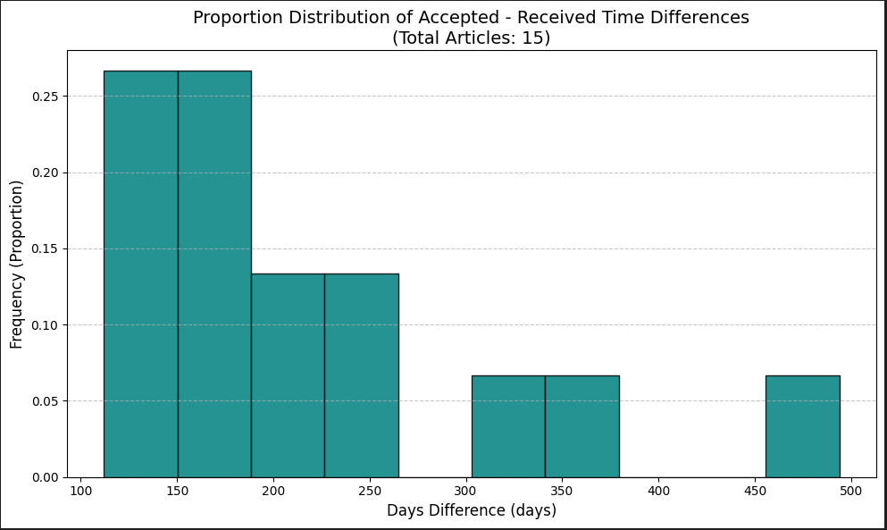

<!-- Improved compatibility of back to top link: See: https://github.com/othneildrew/Best-README-Template/pull/73 -->
<a id="readme-top"></a>

<!-- PROJECT LOGO -->
<br />
<div align="center">
  <a href="https://github.com/HelpLee/Springer-Crawler">
    
  </a>

  <h3 align="center">Springer-crawler</h3>

  <p align="center">
    A Python-based web scraper for extracting publication metadata from scientific journals, including titles, submission (received, revised, accepted), and online dates. This tool automates data collection from platforms like SpringerLink, making it easier for researchers to gather insights efficiently.
    <br />
    ·
    <a href="https://github.com/HelpLee/Springer-Crawler/issues/new?labels=bug&template=bug-report---.md">Report Bug</a>
    ·
  </p>
</div>

<!-- TABLE OF CONTENTS -->
<details>
  <summary>Table of Contents</summary>
  <ol>
    <li>
      <a href="#about-the-project">About The Project</a>
      <ul>
        <li><a href="#built-with">Built With</a></li>
      </ul>
    </li>
    <li>
      <a href="#getting-started">Getting Started</a>
      <ul>
        <li><a href="#prerequisites">Prerequisites</a></li>
        <li><a href="#installation">Installation</a></li>
      </ul>
    </li>
    <li><a href="#usage">Usage</a></li>
    <li><a href="#license">License</a></li>
  </ol>
</details>

<!-- ABOUT THE PROJECT -->
## About The Project
<div align="center">
  
</div>
  
### Purpose of the Project

Researching and analyzing scientific journals often requires accessing metadata like:
- Article titles.
- Important publication dates (e.g., Received, Revised, Accepted, Available Online).
- The time intervals between different stages of publication.

Manually gathering this data can be time-consuming, especially when dealing with multiple volumes or journals. This script automates the process to:

1. Save time by automating journal data extraction.

2. Improve accuracy by handling large volumes of data consistently.

3. Provide insights through visualizing publication delays (e.g., the time between submission and acceptance).

<p align="right">(<a href="#readme-top">back to top</a>)</p>

### Features of the Project

1. **Web Scraping and Automation**:
   - Utilizes **requests** and **lxml** to parse HTML content and extract relevant metadata.
   - Supports scraping journal metadata from **SpringerLink** to gather information such as article titles, submission dates, and acceptance dates.

2. **Query Specific Issues or Recent Articles**:
   - Allows users to **query by volume and issue** or **recent articles**.
   - Extracts metadata such as "Received", "Revised", "Accepted", and "Published" dates from articles.

3. **Data Saving**:
   - Saves the extracted data to a **CSV file** for further analysis.

4. **User Input and Flexibility**:
   - Prompts users for input (e.g., journal name, volume-issue number, number of recent articles).
   - Handles user inputs to dynamically construct URLs and scrape specific data.

5. **Error Handling**:
   - Provides informative feedback if no results are found or if input is invalid.

<p align="right">(<a href="#readme-top">back to top</a>)</p>

### Built With

This project is built with the following major libraries and frameworks:

- [requests](https://docs.python-requests.org/en/latest/) - For making HTTP requests to fetch web pages.
- [lxml](https://lxml.de/) - For parsing HTML and XML content.
- [csv](https://docs.python.org/3/library/csv.html) - For saving extracted data to CSV files.
- [re (Regular Expressions)](https://docs.python.org/3/library/re.html) - For extracting specific patterns from the HTML content.

<p align="right">(<a href="#readme-top">back to top</a>)</p>

<!-- GETTING STARTED -->
## Getting Started

To set up and run the project locally, follow these steps:

### Prerequisites

1. Python: Ensure Python 3.7 or higher is installed.
2. Libraries: Install the required libraries using pip:
  ```bash
  pip install requests lxml
  ```

### Installation

1. Clone the repository
```bash
git clone https://github.com/your_username/Springer-Crawler.git
cd Springer-Crawler
```

2. Run the script:
```bash
python scraper.py
```

3. Follow the on-screen prompts to:
    - Enter the journal name (e.g., "Nature Physics").
    - Choose whether to query recent articles or a specific volume and issue.
    - Save the extracted data to a CSV file for analysis.

<p align="right">(<a href="#readme-top">back to top</a>)</p>

<!-- USAGE EXAMPLES -->
## Usage

### Detailed Step-by-Step Usage:
1. **Run the Script**:
   - Start the script by running the following command:
     ```bash
     python scraper.py
     ```

2. **Enter Journal Name**:
   - The script will prompt you to enter the journal name. Simply enter the full name of the journal (e.g., "Nature Chemistry").

3. **Select Query Mode**:
   - You will be asked whether you want to:
     - **Query Recent Articles**: Enter '0' to scrape metadata for a specific number of recent articles.
     - **Query by Volume and Issue**: Enter '1' to specify a particular volume and issue of the journal.

4. **Input Details for Query**:
   - **For Recent Articles**:
     - Enter the number of recent articles you wish to scrape (e.g., "5" for the latest 5 articles).
   - **For Specific Volume and Issue**:
     - Enter the volume and issue in the format "Volume-Issue" (e.g., "1-1" for Volume 1, Issue 1).

5. **Processing**:
   - The script will process the given input, access the relevant journal pages, and start fetching metadata like titles, received dates, revised dates, accepted dates, and publication dates.
   - You will see progress messages indicating which articles are being processed.

6. **CSV Output**:
   - Once the data extraction is complete, the extracted metadata will be saved in a CSV file.
   - The CSV file will be located in the "Journal_Acceptance_Statistics" directory with the naming convention `{journal_title}_Volume_{volume}_Issue_{issue}.csv` or `{journal_title}_latest_{num_articles}_articles.csv`.

### Example Output:

#### CSV File:
```csv
Received, Revised, Accepted, Published, Issue Date
01 January 2023, 15 January 2023, 20 January 2023, 25 January 2023, ...
```

<p align="right">(<a href="#readme-top">back to top</a>)</p>

<!-- LICENSE -->
## License

Distributed under the MIT License. See `LICENSE.txt` for more information.

<p align="right">(<a href="#readme-top">back to top</a>)</p>

### ⚠️ Warning

- **Use Responsibly**: This tool is intended for educational and research purposes only. Avoid frequent scraping to prevent being flagged or banned by the website.
- **Check `robots.txt`**: Ensure your scraping activities comply with the website's [robots.txt](https://en.wikipedia.org/wiki/Robots_exclusion_standard) rules and do not violate its terms of service.
- **Legal Disclaimer**: The author is not responsible for any consequences resulting from the misuse of this tool.
- **Delay Between Requests**: The script includes delays between requests to simulate human browsing. Please do not modify these unnecessarily to reduce the risk of detection.

<p align="right">(<a href="#readme-top">back to top</a>)</p>
